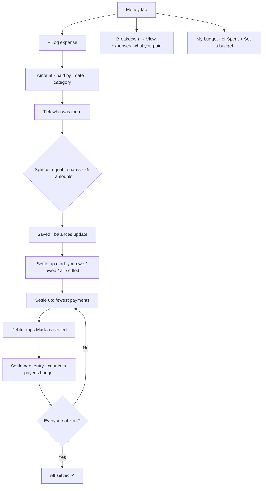

# Fargo — Group Expenses (planning)

> **Working doc — 2026-09-26. Planning only, nothing built.** Decisions D1–D22 agreed; the spec below is a draft for review. Nothing gets built until it is signed off.

---

## Why

A 7-person trip showed the current model breaks down: one planner can't log everyone's spending, and "split equally among everyone" doesn't match reality — not everyone joins every dinner. Kittysplit handled it well: everyone logs what they paid, picks who it was for, and the app works out who owes whom.

**Guardrail:** Fargo stays a travel app, not a split app. Expense features live inside a trip (its travellers, dates and currency), never a standalone ledger — but stay independent of schedule activities (D16). If splitting starts to overshadow trip planning, we invest in trip features to rebalance.

---

## How money works today (v0.3.7)

- Only the **planner** can add, edit or delete expenses; members can only view.
- **Paid by** is always the planner. Every expense is split **equally among all travellers**.
- **Budget** is per person (`travellers.budget_total`, MYR). "Spent" = your equal share of every expense. Daily free budget = (budget − fixed costs) ÷ trip days.
- One frozen FX rate per trip; everything stored in local currency + MYR.
- No balances, no settle-up.

---

## Decided

| # | Decision | Date |
|---|---|---|
| D1 | **Every traveller can add and edit money** — an exception to "only the planner edits". (A planner-only version was rejected: one person can't log for seven.) | 2026-09-26 |
| D2 | **Split by participants:** each expense picks who it's for, from the group. | 2026-09-26 |
| D3 | **Split types:** equal among participants, by percentage, custom amounts, or **shares** (e.g. a couple = 2 shares; default shares can be pre-set per traveller, like Kittysplit). | 2026-09-26 |
| D4 | **Budget counts what you actually paid out**, not your share. | 2026-09-26 |
| D5 | **Budget is optional, per traveller** — each person decides whether to set one. | 2026-09-26 |
| D6 | **Budget stays personal**, not a group budget. | 2026-09-26 |
| D7 | **Budget = cash out of your pocket.** Paying for others counts in full; repayments you receive do **not** reduce your spent. Settle-up is tracked separately from budget. | 2026-09-26 |
| D8 | **Edit rights:** you can edit/delete only expenses you logged; the planner can edit any. | 2026-09-26 |
| D9 | **One payer per expense.** Two cards used → log two expenses. | 2026-09-26 |
| D10 | **Participants start unticked** — you tick who was there. | 2026-09-26 |
| D11 | **Each traveller sets only their own budget.** | 2026-09-26 |
| D12 | **Settle-up follows Kittysplit exactly:** the app shows the fewest payments needed (everyone who owes "puts money in the middle", everyone owed "takes from the middle" — so you may pay someone you never paid for directly). The **person who owes** taps "Mark as settled"; this records the repayment as an entry in the expense list and removes them from the debt list. Deleting that entry undoes it. | 2026-09-26 |
| D13 | **Balances and settle-up in the trip's local currency** (Kittysplit's equivalent: the kitty's home currency). | 2026-09-26 |
| D14 | **Settle-up payments count toward the payer's budget** (cash out of pocket, per D7). The receiver's spent is unchanged. | 2026-09-26 |
| D15 | **Existing trips convert** to participants = everyone, payer = planner. (Planner's "spent" on past trips rises to the full amounts paid — correct under D7.) | 2026-09-26 |
| D16 | **Expenses are independent of activities** — no linking an expense to a schedule activity. | 2026-09-26 |
| D17 | **Name-only travellers:** the planner can add people without an account (e.g. "Mum"). They can be payers and participants, so recording is never blocked, and can sign in and claim their name later. | 2026-09-26 |
| D18 | **Placement (option B, revised):** Money tab = *Settle-up card* (you owe / are owed → **Settle up ›** screen) · *My budget* · *Breakdown* with **View expenses ›** opening the full list on its own screen. "+ Log expense" stays on the Money tab. No new trip tab. | 2026-09-26 |
| D19 | **View expenses shows only your expenses** — matching the breakdown above it. | 2026-09-26 |
| D20 | **No budget set:** the budget card shows "Spent SGD 288 · Set a budget". | 2026-09-26 |
| D21 | **All square:** the settle-up card stays and shows "All settled ✓". | 2026-09-26 |
| D22 | **"Your expenses" = what you paid** (matches the breakdown). The **Settle up** screen shows what's behind each balance, so you can check a debt where you'd pay it. | 2026-09-26 |

---

# Spec

> **Draft for review — 2026-09-26.** Built from D1–D22. Items marked **(proposed)** are my calls, not yet agreed — confirm or change them while reviewing.

## 1. Concepts

| Term | Meaning |
|---|---|
| **Traveller** | Someone on the trip. Either has an account, or is **name-only** (D17) — added by the planner, can be a payer or participant, can claim the name later. |
| **Expense** | Something one traveller **paid** (D9) for a set of **participants** (D2), split one of four ways (D3). Has a **logged by** traveller (for edit rights, D8) separate from **paid by**. |
| **Share** | One participant's portion of an expense, in local currency. Shares of an expense always add up to its amount. |
| **Settlement** | A repayment from the person who owes to the person owed, created by **Mark as settled** (D12). Stored as a special expense: payer = debtor, single participant = creditor. Shows as an entry in the list; deleting it undoes it. |
| **Balance** | Per traveller, in local currency (D13): *what you paid* − *your shares*. Positive = you're owed; negative = you owe. Balances across the trip always sum to zero. |
| **Budget** | Optional, personal (D5, D6, D11). *Spent* = cash out of your pocket in MYR: every expense you paid, **including settlements you paid** (D7, D14). Repayments you receive don't reduce it. |

## 2. Data model

**`travellers`** (changes)
- `account_id` already nullable → a null account is a **name-only** traveller.
- `+ default_shares integer not null default 1` — pre-set shares, e.g. a couple = 2 (D3).

**`expenses`** (changes)
- `+ kind` — `expense` | `settlement`.
- `+ split_type` — `equal` | `shares` | `percent` | `amount`. Settlements use `amount`.
- `+ created_by uuid → travellers` — who logged it (D8).
- `paid_by` — **change `ON DELETE CASCADE` to `RESTRICT`**. Today, removing a traveller silently deletes every expense they paid.
- `is_shared` — retired after migration (D15). `activity_id` — unused (D16), dropped later.
- `category` for settlements: `settlement` (new value, never offered in the chip picker).

**`expense_participants`** (new)

| Column | Notes |
|---|---|
| `expense_id` → expenses, cascade | |
| `traveller_id` → travellers, restrict | |
| `weight numeric` | What the user entered: `1` (equal), shares, percent, or amount |
| `share numeric(12,2)` | Computed local-currency share, saved so balances never drift |

Primary key `(expense_id, traveller_id)`.

## 3. Calculations

**Shares from weights** — at save time, on the server:
- *Equal*: amount ÷ participants. *Shares*: amount × weight ÷ total weights. *Percent*: must total 100. *Amount*: must total the expense amount exactly.
- **Rounding** (proposed): round each share to 2 decimals, then hand the leftover cents one at a time to participants in list order, so shares always add up to the amount exactly.

**Balance** (per traveller) = Σ `amount` of expenses they paid − Σ their `share`s. Settlements fit the same formula with no special case.

**Fewest payments** (D12) — Kittysplit's "middle of the table": take the largest debtor and the largest creditor, pay the smaller of the two amounts, repeat. At most *travellers − 1* payments. Anyone may end up paying someone they never directly owed — that's expected.

**Budget spent** (MYR) = Σ `amount_myr` of expenses **paid by you**, settlements included.
- **Breakdown** shows the same set by category; settlements appear as their own *Settle-ups* line (proposed).
- **Daily free budget** stays *(budget − fixed costs) ÷ trip days*, using fixed categories you paid. Known effect of D7: whoever pays the hotel carries it as a fixed cost; the rest see their share only after they settle up.

## 4. Permissions

| Action | Who |
|---|---|
| See all expenses, shares and balances on the trip | Every traveller on the trip (needed to check debts) |
| Log an expense | Any traveller with an account; `created_by` = themselves; payer can be anyone on the trip, including name-only |
| Edit / delete an expense | Whoever logged it; the planner can edit any (D8) |
| Mark as settled | The traveller who owes (D12). **For a name-only debtor, the planner marks on their behalf** (proposed) |
| Undo a settlement (delete it) | Same as edit rules — whoever marked it, or the planner |
| Set a budget | Each traveller, own budget only (D11) — via a `set_my_budget` function, because row rules can't limit which columns a member edits |
| Add / rename / remove name-only travellers, set default shares | Planner |

Implemented as RLS on `expenses` and `expense_participants` (checked against the caller's traveller row), plus database functions for writes that must stay consistent (save an expense and its participants together, mark as settled).

## 5. Screens

**S1 · Money tab** (D18)
1. *Settle-up card* — "You owe SGD 28" / "You're owed SGD 40" / "All settled ✓" (D21) → **Settle up ›**
2. *My budget* — "SGD 612 left of SGD 900 · daily SGD 85", or with no budget "Spent SGD 288 · Set a budget" (D20)
3. *Breakdown* — your cash out by category → **View expenses ›**
4. **+ Log expense**

**S2 · Log / edit expense** (Add activity layout)
- Amount (hero, local ⇄ MYR toggle as today) · What for · **Paid by** (defaults to you; pick anyone) · Date · Category chips
- **Split between** — traveller chips, **all unticked** (D10); a "Select all" shortcut (proposed)
- **Split as** — Equal · Shares · % · Amounts. For anything but Equal, each ticked person gets an input (Shares pre-filled from default shares); a live line shows what's left to allocate, and Log stays blocked until it adds up
- Notes · Cancel / Log · edit mode: Delete (if allowed)

**S3 · View expenses** — expenses **you paid**, including settlements (D19, D22), grouped by date, newest first. Tap to edit (if allowed).

**S4 · Settle up**
- *Fewest payments* — "You → Song SGD 28". Your own rows have **Mark as settled** → confirm dialog with the amount.
- Tap a row to see **what's behind it** (D22): your paid expenses and your shares that make up your balance. Because payments are simplified, a row explains your overall balance, not a debt to one specific person.
- *Balances* — everyone's +/− in local currency.
- *Settled* — recent settlements, each with Undo (if allowed).

**S5 · Trip settings → Travellers** (planner) — add a name-only traveller, set default shares, remove (blocked while they have expenses — see edge cases).

**S6 · Invite join → claim a name** (proposed) — if the trip has name-only travellers, the joiner picks "I'm Mum" or "I'm new". Claiming links their account to that traveller; all history stays.

**S7 · Set budget** — own budget only.

## 5b. User flow (summary)

Full diagrams (log, settle up, Money tab map, name-only travellers): https://claude.ai/artifact/8V84ZFzNX9PvY4q6afpFZk

## 6. Edge cases

- **Editing after settling** — balances recompute; old settlements stay as they were. Debts can change or flip, as in Kittysplit.
- **Leaving / removing a traveller with expenses** (proposed) — blocked while they are a payer or participant anywhere. The planner can instead convert them to **name-only** (unlink the account), so history is kept.
- **Payer not a participant** — allowed (paying for others).
- **No participants ticked** — can't save.
- **Logged in MYR** — converted to local with the trip's fixed rate, and the MYR value is stored, as today.
- **Trip FX rate changed later** — existing expenses keep the rate they were logged with (frozen), as today.
- **Old trips** (D15) — see migration.

## 7. Migration (D15)

For every existing expense: `kind = expense`, `split_type = equal`, `created_by = paid_by`. Participants = **every traveller on the trip** if `is_shared`, otherwise **the payer only**, with shares computed by the rounding rule. Then switch `paid_by` to `RESTRICT`.

Effect: the planner's "spent" on past trips rises to the full amounts they paid (D7).

## 8. Build phases (proposed)

1. **Data + permissions** — tables, columns, RLS, functions (save expense, mark settled, set my budget), migration of old expenses.
2. **Log expense with split** — S2.
3. **Money tab** — S1 and S3; budget and breakdown switch to cash out.
4. **Settle up** — S4.
5. **Name-only travellers** — S5 and S6.
6. **Test on a 7-person test trip** — name-only travellers, all four split types, settling up, undo.

Each phase ships on its own, with SQL run before deploy.

## 9. Still to confirm (my proposals)

1. Rounding: leftover cents go to participants in list order.
2. Settlements show as a *Settle-ups* line in your breakdown.
3. The planner marks settled for name-only debtors.
4. A "Select all" shortcut on participant chips (they still start unticked).
5. Claiming a name-only traveller when joining by invite.
6. Leaving / removal blocked while a traveller has expenses; planner can convert them to name-only instead.

---

## Sources

- Kittysplit help — settling up, currencies, split types: https://www.kittysplit.com/en/help

---

## Out of scope (for now)

Payment integrations (DuitNow, bank links) · payment reminders/nudges · groups or ledgers outside a trip · receipts/photo attachments · per-traveller home currencies.
