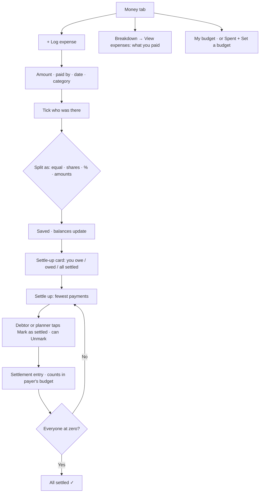

# Fargo — Group Expenses (planning)

> **Working doc — 2026-09-26. Planning only, nothing built.** Decisions D1–D22 agreed; the spec below is a draft for review. Nothing gets built until it is signed off.

---

## Why

A 7-person trip showed the current model breaks down: one planner can't log everyone's spending, and "split equally among everyone" doesn't match reality — not everyone joins every dinner. Kittysplit handled it well: everyone logs what they paid, picks who it was for, and the app works out who owes whom.

**Guardrail:** Fargo stays a travel app, not a split app. Expense features live inside a trip (its travellers, dates and currency), never a standalone ledger — but stay independent of schedule activities (D16). If splitting starts to overshadow trip planning, we invest in trip features to rebalance.

---

## How money works today (v0.3.7)

- Only the **planner** can add, edit or delete expenses; members can only view.
- **Paid by** is always the planner. Every expense is split **equally among all travellers**.
- **Budget** is per person (`travellers.budget_total`, MYR). "Spent" = your equal share of every expense. Daily free budget = (budget − fixed costs) ÷ trip days.
- One frozen FX rate per trip; everything stored in local currency + MYR.
- No balances, no settle-up.

---

## Decided

| # | Decision | Date |
|---|---|---|
| D1 | **Every traveller can add and edit money** — an exception to "only the planner edits". (A planner-only version was rejected: one person can't log for seven.) | 2026-09-26 |
| D2 | **Split by participants:** each expense picks who it's for, from the group. | 2026-09-26 |
| D3 | **Split types:** equal among participants, by percentage, custom amounts, or **shares** (e.g. a couple = 2 shares; default shares can be pre-set per traveller, like Kittysplit). | 2026-09-26 |
| D4 | **Budget counts what you actually paid out**, not your share. | 2026-09-26 |
| D5 | **Budget is optional, per traveller** — each person decides whether to set one. | 2026-09-26 |
| D6 | **Budget stays personal**, not a group budget. | 2026-09-26 |
| D7 | **Budget = cash out of your pocket.** Paying for others counts in full; repayments you receive do **not** reduce your spent. Settle-up is tracked separately from budget. | 2026-09-26 |
| D8 | **Edit rights:** you can edit/delete only expenses you logged; the planner can edit any. | 2026-09-26 |
| D9 | **One payer per expense.** Two cards used → log two expenses. | 2026-09-26 |
| D10 | **Participants start unticked** — you tick who was there. | 2026-09-26 |
| D11 | **Each traveller sets only their own budget.** | 2026-09-26 |
| D12 | **Settle-up follows Kittysplit exactly:** the app shows the fewest payments needed (everyone who owes "puts money in the middle", everyone owed "takes from the middle" — so you may pay someone you never paid for directly). The **person who owes** taps "Mark as settled"; this records the repayment as an entry in the expense list and removes them from the debt list. Deleting that entry undoes it. | 2026-09-26 |
| D13 | **Balances and settle-up in the trip's local currency** (Kittysplit's equivalent: the kitty's home currency). | 2026-09-26 |
| D14 | **Settle-up payments count toward the payer's budget** (cash out of pocket, per D7). The receiver's spent is unchanged. | 2026-09-26 |
| D15 | **Existing trips convert** to participants = everyone, payer = planner. (Planner's "spent" on past trips rises to the full amounts paid — correct under D7.) | 2026-09-26 |
| D16 | **Expenses are independent of activities** — no linking an expense to a schedule activity. | 2026-09-26 |
| D17 | **Name-only travellers:** the planner can add people without an account (e.g. "Mum"). They can be payers and participants, so recording is never blocked, and can sign in and claim their name later. | 2026-09-26 |
| D18 | **Placement (option B, revised):** Money tab = *Settle-up card* (you owe / are owed → **Settle up ›** screen) · *My budget* · *Breakdown* with **View expenses ›** opening the full list on its own screen. "+ Log expense" stays on the Money tab. No new trip tab. | 2026-09-26 |
| D19 | **View expenses shows only your expenses** — matching the breakdown above it. | 2026-09-26 |
| D20 | **No budget set:** the budget card shows "Spent SGD 288 · Set a budget". | 2026-09-26 |
| D21 | **All square:** the settle-up card stays and shows "All settled ✓". | 2026-09-26 |
| D22 | **"Your expenses" = what you paid** (matches the breakdown). The **Settle up** screen shows what's behind each balance, so you can check a debt where you'd pay it. | 2026-09-26 |
| D23 | **Claiming a name:** when joining by invite, the joiner can pick an unclaimed name-only traveller ("I'm Mum"). The claim screen shows what's attached to each name (e.g. "paid 1 · in 2"). A wrong claim can be **unlinked by the person who claimed it, or the planner** — the traveller goes back to name-only with history intact. | 2026-09-26 |
| D24 | **Settle up is simple by default:** your own payments first ("You pay Ali SGD 20" + Mark as settled); tap a payment to see why; everyone's payments and balances sit in a collapsed *Everyone* section. | 2026-09-26 |
| D25 | **Mark and unmark settled: the person who owes, or the planner** (who also covers name-only travellers). The receiver can't. Unmark is an explicit button in the *Settled* list. | 2026-09-26 |
| D26 | **Rounding:** shares round to 2 decimals; leftover cents go to participants in list order, so shares always add up exactly. | 2026-09-26 |
| D27 | **Settlements in the breakdown:** shown as their own *Settle-ups* line in the payer's breakdown, and listed in their View expenses. | 2026-09-26 |
| D28 | **Select all / Clear:** participants start unticked; the shortcut reads **Select all**, and switches to **Clear** only when everyone is ticked (e.g. 6 of 7 ticked still shows Select all). | 2026-09-26 |
| D29 | **Leaving or removal with expenses is blocked**; the planner can convert the traveller to name-only instead, keeping history. | 2026-09-26 |
| D30 | **In-between card state:** when you're square but others still owe — "You're settled up · N payments still open in the group". | 2026-09-26 |
| D31 | **Budget switch ships in Phase 2** (not 3): spent = what you paid, as soon as other payers are possible. | 2026-09-27 |
| D32 | **Split as a list:** one row per traveller — tick box, name on the left, value on the right (computed share for Equal; input + resulting amount for Shares/%; the amount itself for Amounts). **Paid by is a dropdown** above the list. | 2026-09-27 |
| D33 | **% and Amounts pre-fill evenly** (leftover cents/percent in list order); Shares pre-fill from default shares. | 2026-09-27 |
| D34 | **Split values are always in local currency**, even when the total was typed in MYR. | 2026-09-27 |
| D35 | **Read-only view** when you tap an expense you can't edit. | 2026-09-27 |
| D36 | **3 test travellers (no accounts) on Test trip only**, kept through Phases 2–5 for testing. | 2026-09-27 |

---

# Spec

> **Final draft — 2026-09-26.** Built from D1–D30. All proposals agreed; ready to plan Phase 1 once signed off.

## 1. Concepts

| Term | Meaning |
|---|---|
| **Traveller** | Someone on the trip. Either has an account, or is **name-only** (D17) — added by the planner, can be a payer or participant, can claim the name later. |
| **Expense** | Something one traveller **paid** (D9) for a set of **participants** (D2), split one of four ways (D3). Has a **logged by** traveller (for edit rights, D8) separate from **paid by**. |
| **Share** | One participant's portion of an expense, in local currency. Shares of an expense always add up to its amount. |
| **Settlement** | A repayment from the person who owes to the person owed, created by **Mark as settled** (D12). Stored as a special expense: payer = debtor, single participant = creditor. Shows as an entry in the list; deleting it undoes it. |
| **Balance** | Per traveller, in local currency (D13): *what you paid* − *your shares*. Positive = you're owed; negative = you owe. Balances across the trip always sum to zero. |
| **Budget** | Optional, personal (D5, D6, D11). *Spent* = cash out of your pocket in MYR: every expense you paid, **including settlements you paid** (D7, D14). Repayments you receive don't reduce it. |

## 2. Data model

**`travellers`** (changes)
- `account_id` already nullable → a null account is a **name-only** traveller.
- `+ default_shares integer not null default 1` — pre-set shares, e.g. a couple = 2 (D3).

**`expenses`** (changes)
- `+ kind` — `expense` | `settlement`.
- `+ split_type` — `equal` | `shares` | `percent` | `amount`. Settlements use `amount`.
- `+ created_by uuid → travellers` — who logged it (D8).
- `paid_by` — **change `ON DELETE CASCADE` to `RESTRICT`**. Today, removing a traveller silently deletes every expense they paid.
- `is_shared` — retired after migration (D15). `activity_id` — unused (D16), dropped later.
- `category` for settlements: `settlement` (new value, never offered in the chip picker).

**`expense_participants`** (new)

| Column | Notes |
|---|---|
| `expense_id` → expenses, cascade | |
| `traveller_id` → travellers, restrict | |
| `weight numeric` | What the user entered: `1` (equal), shares, percent, or amount |
| `share numeric(12,2)` | Computed local-currency share, saved so balances never drift |

Primary key `(expense_id, traveller_id)`.

## 3. Calculations

**Shares from weights** — at save time, on the server:
- *Equal*: amount ÷ participants. *Shares*: amount × weight ÷ total weights. *Percent*: must total 100. *Amount*: must total the expense amount exactly.
- **Rounding** (D26): round each share to 2 decimals, then hand the leftover cents one at a time to participants in list order, so shares always add up to the amount exactly.

**Balance** (per traveller) = Σ `amount` of expenses they paid − Σ their `share`s. Settlements fit the same formula with no special case.

**Fewest payments** (D12) — Kittysplit's "middle of the table": take the largest debtor and the largest creditor, pay the smaller of the two amounts, repeat. At most *travellers − 1* payments. Anyone may end up paying someone they never directly owed — that's expected.

**Budget spent** (MYR) = Σ `amount_myr` of expenses **paid by you**, settlements included.
- **Breakdown** shows the same set by category; settlements appear as their own *Settle-ups* line (D27).
- **Daily free budget** stays *(budget − fixed costs) ÷ trip days*, using fixed categories you paid. Known effect of D7: whoever pays the hotel carries it as a fixed cost; the rest see their share only after they settle up.

## 4. Permissions

| Action | Who |
|---|---|
| See all expenses, shares and balances on the trip | Every traveller on the trip (needed to check debts) |
| Log an expense | Any traveller with an account; `created_by` = themselves; payer can be anyone on the trip, including name-only |
| Edit / delete an expense | Whoever logged it; the planner can edit any (D8) |
| Mark as settled / Unmark | The traveller who owes, or the planner — including for name-only travellers (D25). Not the receiver |
| Unlink a claimed name | The person who claimed it, or the planner (D23) |
| Set a budget | Each traveller, own budget only (D11) — via a `set_my_budget` function, because row rules can't limit which columns a member edits |
| Add / rename / remove name-only travellers, set default shares | Planner |

Implemented as RLS on `expenses` and `expense_participants` (checked against the caller's traveller row), plus database functions for writes that must stay consistent (save an expense and its participants together, mark as settled).

## 5. Screens

**S1 · Money tab** (D18)
1. *Settle-up card* — "You owe SGD 28" / "You're owed SGD 40" / "You're settled up · N payments still open" (D30) / "All settled ✓" (D21) → **Settle up ›**
2. *My budget* — "SGD 612 left of SGD 900 · daily SGD 85", or with no budget "Spent SGD 288 · Set a budget" (D20)
3. *Breakdown* — your cash out by category → **View expenses ›**
4. **+ Log expense**

**S2 · Log / edit expense** (Add activity layout)
- Amount (hero, local ⇄ MYR toggle as today) · What for · **Paid by** (defaults to you; pick anyone) · Date · Category chips
- **Split between** — traveller chips, **all unticked** (D10); shortcut reads **Select all**, switching to **Clear** only when everyone is ticked (D28)
- **Split as** — Equal · Shares · % · Amounts. For anything but Equal, each ticked person gets an input (Shares pre-filled from default shares); a live line shows what's left to allocate, and Log stays blocked until it adds up
- Notes · Cancel / Log · edit mode: Delete (if allowed)

**S3 · View expenses** — expenses **you paid**, including settlements (D19, D22), grouped by date, newest first. Tap to edit (if allowed).

**S4 · Settle up** (D24)
- *Your payments* — only the ones involving you: "You pay Ali SGD 20" with **Mark as settled** (confirm dialog), or "Jun pays you SGD 20". Nothing to do → "You're settled up".
- Tap a payment to see **why** (D22): your paid expenses and your shares. Because payments are simplified, this explains your overall balance, not a debt to one specific person.
- *Everyone* (collapsed) — all payments and balances in the group.
- *Settled* — settlements, each with **Unmark** for the person who owed and the planner (D25).

**S5 · Trip settings → Travellers** (planner) — add a name-only traveller, set default shares, **unlink** a claimed name (D23), remove (blocked while they have expenses — see edge cases). A traveller who claimed a name can also unlink it from here.

**S6 · Invite join → claim a name** (D23) — if the trip has name-only travellers, the joiner picks "I'm Mum" (shown with what's attached, e.g. "paid 1 · in 2") or "I'm new". Claiming links their account to that traveller; all history stays.

**S7 · Set budget** — own budget only.

## 5b. User flow (summary)

Full diagrams (log, settle up, Money tab map, name-only travellers): https://claude.ai/artifact/8V84ZFzNX9PvY4q6afpFZk

## 6. Edge cases

- **Editing after settling** — balances recompute; old settlements stay as they were. Debts can change or flip, as in Kittysplit.
- **Leaving / removing a traveller with expenses** (D29) — blocked while they are a payer or participant anywhere. The planner can instead convert them to **name-only** (unlink the account), so history is kept.
- **Payer not a participant** — allowed (paying for others).
- **No participants ticked** — can't save.
- **Logged in MYR** — converted to local with the trip's fixed rate, and the MYR value is stored, as today.
- **Trip FX rate changed later** — existing expenses keep the rate they were logged with (frozen), as today.
- **Old trips** (D15) — see migration.

## 7. Migration (D15)

For every existing expense: `kind = expense`, `split_type = equal`, `created_by = paid_by`. Participants = **every traveller on the trip** if `is_shared`, otherwise **the payer only**, with shares computed by the rounding rule. Then switch `paid_by` to `RESTRICT`.

Effect: the planner's "spent" on past trips rises to the full amounts they paid (D7).

## 8. Build phases (proposed)

1. **Data + permissions** — tables, columns, RLS, functions (save expense, mark settled, set my budget), migration of old expenses.
2. **Log expense with split** — S2.
3. **Money tab** — S1 and S3; budget and breakdown switch to cash out.
4. **Settle up** — S4.
5. **Name-only travellers** — S5 and S6.
6. **Test on a 7-person test trip** — name-only travellers, all four split types, settling up, undo.

Each phase ships on its own, with SQL run before deploy. Versions: the whole feature is **v0.4.x** — Phase 1 = v0.4.0, Phase 2 = v0.4.1, Phase 3 = v0.4.2, and so on.

## 9. Status

All proposals agreed (D26–D30). **Phase 1 shipped (v0.4.0) and Phase 2 shipped (v0.4.1), 2026-09-27.** Next: plan Phase 3 — Money tab (S1, S3) and setting your own budget.

## 10. Phase 1 — data + permissions ✅ shipped v0.4.0, 2026-09-27

> Part A, verify, v0.4.0 deploy, part B and the Test trip checks all done; verify re-run all true after testing.

**Goal:** the database can store group expenses and every existing expense is converted — with **no visible change** in either app. Screens come in Phase 2+.

**Constraint:** the native app (`fargo-app`) uses the same database and writes expenses directly (`paid_by`, `is_shared`). Phase 1 must keep it working unchanged.

### What changes in the database

1. **New types** — `expense_kind` (expense / settlement), `split_type` (equal / shares / percent / amount).
2. **`expenses`** — add `kind` (default expense), `split_type` (default equal), `created_by` (→ travellers). Keep `is_shared` for now (the native app still uses it). Settlements use `category = misc` and are told apart by `kind` — no change to the category list shared with activities.
3. **`expense_participants`** — new table (expense, traveller, weight, share).
4. **`travellers.default_shares`** — integer, default 1.
5. **Foreign keys** — `paid_by`, `created_by` and participant → traveller become `NO ACTION` instead of `CASCADE`, so removing a traveller can no longer silently delete expenses. (`NO ACTION`, not `RESTRICT`, so deleting a whole trip still works.)
6. **Backfill (D15)** — every existing expense gets `created_by = paid_by` and participants: everyone on the trip if `is_shared`, else the payer only. Shares split with the rounding rule (D26).
7. **Compatibility trigger** — when an expense is written the old way (no `created_by`, e.g. the native app), the database fills `created_by` and builds the participants from `is_shared` automatically. This keeps old-style writes correct until the native app adopts group expenses.
8. **`save_expense` / `delete_expense` functions** — the new, only-sanctioned write path: check the caller is on the trip, edit rights (D8), payer and participants belong to the trip, weights add up (D3), compute shares (D26), and save expense + participants together.
9. **Read access** — every traveller on the trip can read participants (same as expenses today).
10. **Leaving / removal** — `leave_trip` and remove-traveller return a clear message when the traveller has expenses (D29), instead of a database error.

Direct table writes by the planner stay allowed in Phase 1 (the native app needs them). They're removed only once both apps use the functions.

### What changes in the PWA

- `createExpense` / `updateExpense` / `deleteExpense` call the new functions, sending "everyone on the trip, equal" — exactly today's behaviour, so nothing looks different.
- No UI changes. Budget maths unchanged until Phase 3.

### Rollout order

1. **Backup** — copy `expenses` to `expenses_backup_20260926` (one SQL statement).
2. **SQL part A** (one transaction) — items 1–9. Additive; both apps keep working. The trigger covers any expense logged by either app during the gap.
3. **Verify** (read-only queries, results pasted back) — every expense has participants; shares add up to each amount; counts match the backup.
4. **Deploy PWA** (v0.4.0).
5. **Test on Test Trip Singapore** — log, edit, delete an expense in the PWA **and** the native app; re-run the verify queries.
6. **SQL part B** — item 10 (friendly leave/remove messages). **Same day as part A:** once old shared expenses include everyone, *any* member of such a trip is blocked from leaving (D29) — part B turns the raw database error into a clear message.

**Files:** `supabase/migrations/20260926_group_expenses_p1a.sql` (part A) · `…_p1a_verify.sql` (checks) · `…_p1a_undo.sql` (undo).

**Staging:** the staging database (`lpiadmuojfbktajvcfzy`) no longer resolves — paused or deleted — so Phase 1 uses the backup approach on production.

**Undo:** until part B, dropping the new table/columns and restoring from the backup returns everything to today's state.

### We are Riize (settled in real life)

Recorded as settled **at Phase 4**, not Phase 1: until the Money tab understands settlements (Phase 3–4), a settlement row would show up as an ordinary expense and inflate everyone's spent.

### Out of Phase 1

Settlement and budget functions (`mark_settled`, `set_my_budget`) ship with Phases 4 and 3. Name-only travellers with Phase 5. Native app changes are a separate decision.

## 11. Phase 2 — log expense with split ✅ shipped v0.4.1, 2026-09-27

**Goal:** anyone on the trip can log an expense, choose who paid and who it's for, and split it four ways (S2). First visible change.

### Why the budget switch moves into Phase 2

Today's budget maths assumes every shared expense is split evenly among everyone and paid by the planner. The moment Phase 2 allows other payers and partial splits, those numbers go wrong. So Phase 2 also switches budget to **cash out of your pocket** (D7): *spent* = everything **you paid**. The Money tab *layout* (settle-up card, View expenses screen) stays in Phase 3.

Visible effect: on past trips the planner's spent rises to the full amounts paid; members' spent drops to what they paid.

### Log / edit expense form (S2, Add activity layout)

| Field | Behaviour |
|---|---|
| Amount | Hero field, local ⇄ MYR toggle as today |
| What for | As today |
| **Paid by** | Dropdown of travellers; defaults to you (D32) |
| Date · Category | As today |
| **Split as** | Equal · Shares · % · Amounts |
| **Split between** (list, D32) | One row per traveller: tick box · name · value. All unticked (D10); "4 of 7" count with **Select all** → **Clear** only when everyone is ticked (D28). Equal shows each share; Shares/% show an input plus the resulting amount; Amounts shows the amount input. Shares pre-fill from default shares; % and Amounts pre-fill evenly (D33) |
| Remaining line | "SGD 40 left to allocate" / "10% left" — **Log** stays disabled until it adds up |
| Notes · Cancel / Log | As today; Delete link in edit mode if allowed |

Split amounts are always in **local currency** (D34); if you typed the total in MYR, the split works on its local equivalent.

### Who sees what

- **+ Log expense** shows for every traveller, not just the planner (D1).
- Tapping an expense: **edit** if you logged it or you're the planner (D8); otherwise a **read-only view** of who paid and who it's split with (D35).
- Expense rows gain "Ali paid · 4 people".

### Data

- Expenses load with their participants (one query).
- Editing an old expense opens as Equal with everyone ticked — how it was converted.
- People who join the trip later aren't added to past expenses (same as Kittysplit).

### Testing

Test trip (Vietnam) has only you on it, and splits need several people. Add 3 test travellers **to Test trip only** via one SQL insert (no accounts — the database already allows it), kept through Phases 2–5 (D36).

### Out of Phase 2

Money tab layout, own-budget setting for members (Phase 3) · settle up (Phase 4) · adding name-only travellers in the app (Phase 5).

## 12. Phase 3 plan — Money tab + your own budget (draft for review)

**Goal:** the Money tab takes its final shape (S1, S3) and every traveller can set their own budget (S7, D11).

### The ordering problem

D19 says *View expenses* shows only what **you** paid, and D22 puts everyone else's expenses behind **Settle up** — which is Phase 4. If Phase 3 switched the list to "yours only", there'd be a gap where you can't see what others paid.

**Proposed:** Phase 3 builds the new layout but *View expenses* keeps showing **everyone's** expenses for now. Phase 4 adds the settle-up card and screen, and in the same release switches *View expenses* to "what you paid". Every release stays complete; nothing goes missing in between.

### Money tab (S1) after Phase 3

1. **My budget** card
   - With a budget: "SGD 612 left of SGD 900 · daily SGD 85", progress bar, Edit.
   - Without one (D20): "Spent SGD 288" + **Set a budget**.
   - Every traveller sees their own — members too (today members only see "No budget set").
2. **Breakdown** card — what you paid by category, in the existing Fixed / Daily groups. Shown **even without a budget** (today it only appears once a budget is set). Bottom row: **View expenses ›** with a count.
3. **+ Log expense**.
4. The expense list moves off the Money tab onto its own screen.

(The settle-up card joins at the top in Phase 4.)

### View expenses (S3)

- Its own screen inside the trip, with a back arrow to Money.
- Expenses grouped by date, newest first, with daily totals and "Ali paid · 3 people" (as today).
- Tap → edit if allowed, otherwise the read-only view (D8, D35).
- **+ Log expense** here too.
- Phase 3: everyone's expenses. Phase 4: what you paid (D19).

### Your own budget (S7, D11)

- New `set_my_budget(trip_id, amount)` database function — you can only ever set **your own** budget. Needed because the database rules only let the planner edit traveller rows.
- The budget card's Edit / Set a budget uses it for everyone, planner included.
- Budget is still entered in local currency on screen and stored in MYR, as today.
- The native app keeps using its current way (planner only) — nothing breaks.

### Out of Phase 3

Settle-up card and screen, balances, "what you paid" switch, recording We are Riize as settled → Phase 4 · name-only travellers → Phase 5.

---

## Sources

- Kittysplit help — settling up, currencies, split types: https://www.kittysplit.com/en/help

---

## Out of scope (for now)

Payment integrations (DuitNow, bank links) · payment reminders/nudges · groups or ledgers outside a trip · receipts/photo attachments · per-traveller home currencies.
